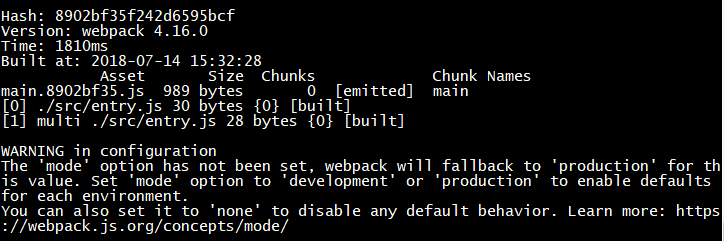

# 介绍 #

> 自2017年8月11日上传了 [webpack-3.x-state](https://github.com/WebUnion-core/webpack-3.x-state) 项目后已过去将近一年时间了，现在 webpack 也已经升级到4.x版本了，是时候学习一波新版 webpack 的配置了。

webpack4 与 webpack3 第一个不同之处：将 webpack 模块拆分为 webpack 和 webpack-cli 两个模块，所以首先要分别安装这两个模块: `npm install -D webpack webpack-cli`。

## state1 ##

接着正式开始阶段一，阶段一是配置一些基本的 Webpack 选项(入口、出口等等)，打包配置文件依然是 webpack.config.js 文件，其初始内容如下:

```js
const path = require('path');

// 路径常量
const SRC_PATH = path.resolve(__dirname, 'src');
const DIST_PATH = path.resolve(__dirname, 'dist');

module.exports = {
    entry: [
        path.resolve(SRC_PATH, 'entry.js')
    ],
    output: {
        path: DIST_PATH,
        filename: 'index.js',
        chunkFilename: 'index.js'
    }
}
```

webpack4 启动打包多了一个开发模式和生产模式的识别操作，如果是开发模式的打包操作，则不会对打包后的代码进行丑化(压缩)，生产模式(默认)则反之。

首先我们需要添加一个打包模式参数，否则直接用`webpack`命令打包会发出以下警告:



添加打包模式由两种方式:

1. 在命令后添加，即执行命令改为`webpack --mode development`;

2. 在 webpack.config.js 中添加:

    ```js
    ...
    module.exports = {
        mode: 'development', // "development"或者"production"
        entry: [
            path.resolve(SRC_PATH, 'entry.js')
        ],
        output: {
            path: DIST_PATH,
            filename: 'index.js',
            chunkFilename: 'index.js'
        }
    }
    ```

## state2 ##

阶段二是第三方模块的抽取，webpack3 中抽取第三方公共模块需要使用 CommonsChunkPlugin 插件，webpack4 则只要配置 optimization 选项即可:

```js
...
module.exports = {
    entry: {
        'index': [
            path.resolve(SRC_PATH, 'entry.js')
        ],
        'vendor': [
            'react',
            'react-dom'
        ]
    },
    output: {
        path: DIST_PATH,
        filename: '[name].js',
        chunkFilename: '[name].js'
    },
    optimization: {
        splitChunks: {
            cacheGroups: {
                vendor: {
                    test: /node_modules/, // 指定是node_modules下的第三方包
                    chunks: 'initial',
                    name: 'vendor', // 打包后的文件名，任意命名
                    // 设置优先级，防止和自定义的公共代码提取时被覆盖，不进行打包
                    priority: 10
                }
            }
        }
    }
}
```

需要特别注意的是 priority 这个选项，如果你要更新打包出来的 vendor 文件的内容，要先把这个选项移除掉，否则打包出来的 vendor 不会更新。

---

```
POST_DATE : 2018/07/14
```
